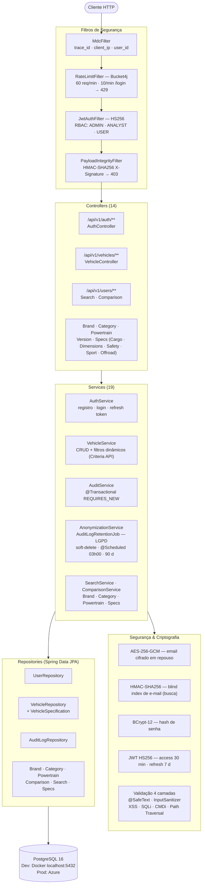

# RIVA Backend

API REST em Java + Spring Boot para o projeto **RIVA** — Challenge Ford FIAP 2026
(Desafio 01: Inteligência Competitiva Automotiva).

Este repositório é o **backend**. O foco desta entrega é a **camada de segurança
(Cybersecurity)** — implementada do zero sobre o esqueleto do projeto.

> 📄 A documentação completa de segurança está em **[SECURITY.md](SECURITY.md)**.

---

## Tecnologias

- Java 21 · Spring Boot 3.3.5
- Spring Web MVC · Spring Data JPA · Spring Validation
- **Spring Security** + **JWT** (jjwt 0.12.5)
- **Bucket4j** 8.10.1 — rate limiting
- **Logback** + Logstash encoder — logs estruturados em JSON
- **SpringDoc / Swagger UI** — documentação da API
- PostgreSQL 16 · Lombok
- H2 (apenas nos testes automatizados)

---

## Arquitetura



---

## Pré-requisitos

Para rodar o projeto você precisa apenas de:

- **JDK 21+**
- **Docker Desktop** ([download](https://www.docker.com/products/docker-desktop/)) — instalado e em execução

Maven **não** é necessário: o projeto inclui o Maven Wrapper (`mvnw.cmd`).

---

## Como rodar

O banco de dados roda em um container Docker; a aplicação roda na sua máquina.

```bash
# 1. Clonar o repositório
git clone https://github.com/FORD-FIAP/rivaIA-backend.git
cd rivaIA-backend

# 2. Subir o banco PostgreSQL (container)
docker compose up -d

# 3. Rodar a aplicação (Windows)
mvnw.cmd spring-boot:run
```

> Em Linux/Mac com Maven instalado, use `mvn spring-boot:run`.

Aguarde a mensagem `Started RivaBackendApplication`. A API fica disponível em
**http://localhost:8080**, e a documentação interativa (Swagger UI) em
**http://localhost:8080/swagger-ui.html**.

- As tabelas são criadas/atualizadas automaticamente (`ddl-auto=update`).
- Um usuário **ADMIN** padrão é criado no primeiro start
  (`username: admin` — senha: variável `ADMIN_DEFAULT_PASSWORD`, default `Admin@123456`).
- Os dados persistem entre execuções (volume Docker `riva-db-data`).

### Comandos úteis do banco

```bash
docker compose up -d      # sobe o banco em background
docker compose down       # para o banco (mantém os dados)
docker compose down -v    # para o banco e APAGA os dados
docker compose logs db    # ver logs do PostgreSQL
```

---

## Perfis de ambiente

O projeto usa Spring Profiles para separar os ambientes:

| Profile | Banco | Uso |
|---------|-------|-----|
| `dev` *(padrão)* | PostgreSQL no container Docker (`localhost:5432`) | Desenvolvimento e avaliação local |
| `prod` | PostgreSQL na Azure | Deploy em produção (credenciais via variáveis de ambiente) |
| `test` | H2 em memória | Testes automatizados (`mvnw.cmd test`) |

O profile `dev` é ativado automaticamente — para rodar e avaliar o projeto
**não é preciso configurar nada** além de subir o Docker.

O profile `prod` exige as variáveis `DB_HOST`, `DB_PORT`, `DB_USER` e
`DB_PASSWORD` e é usado apenas no pipeline de deploy.

---

## Rodar os testes

```bash
mvnw.cmd test
```

Os testes usam um banco H2 em memória — **não precisam do Docker**. A suíte cobre
sanitização de entrada, autenticação/RBAC, rate limiting, CORS, integridade de
payload (HMAC), criptografia em repouso e trilha de auditoria.

---

## Build do artefato

```bash
mvnw.cmd clean package
java -jar target/riva-backend-0.0.1-SNAPSHOT.jar --spring.profiles.active=prod
```

---

## Estrutura do projeto

```
src/main/java/com/ford/riva/
├── config/        # SecurityConfig, RateLimitConfig, DataInitializer
├── controller/    # Endpoints REST (autenticação, veículos, specs, busca)
├── crypto/        # AES-256-GCM (criptografia em repouso), hash de email
├── dto/           # DTOs de request/response (separados das entidades)
├── exception/     # GlobalExceptionHandler — respostas de erro padronizadas
├── model/         # Entidades JPA (User, Role, AuditLog, Vehicle, etc.)
├── repository/    # Spring Data repositories
├── security/      # Filtros (MDC, JWT, rate limit, HMAC), UserDetailsService
├── service/       # Regras de negócio (auth, auditoria, veículos, busca)
├── util/          # InputSanitizer
└── validation/    # Validador customizado @SafeText
```

---

## Avaliação de segurança

A camada de segurança cobre os 5 blocos do desafio. O detalhamento de cada
implementação está no **[SECURITY.md](SECURITY.md)**.

| Bloco | Tema |
|-------|------|
| 1 | Segurança de entrada e validação de dados |
| 2 | Autenticação e autorização (JWT + RBAC) |
| 3 | Proteção de APIs (rate limit, CORS, HMAC) |
| 4 | Segurança de dados e privacidade (AES-256, LGPD) |
| 5 | Monitoramento, logs e auditoria |

### Testar os endpoints

A suíte de testes automatizados (`mvnw.cmd test`) valida cada bloco de segurança,
incluindo casos de ataque que devem ser bloqueados (XSS, SQL injection, acesso
sem token, RBAC negado, CORS proibido).

Para testar manualmente com a aplicação rodando, use a documentação interativa
em **http://localhost:8080/swagger-ui.html**.
