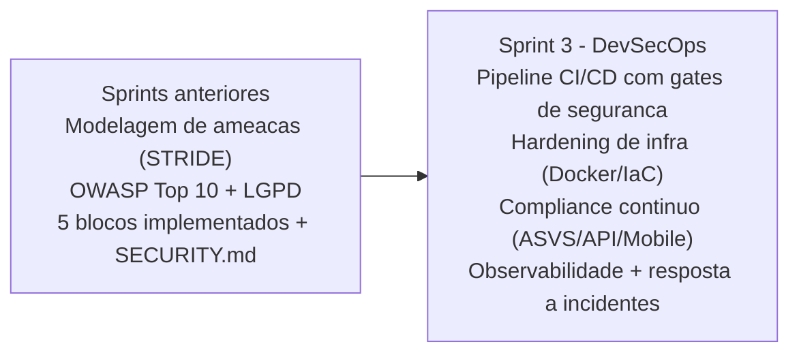
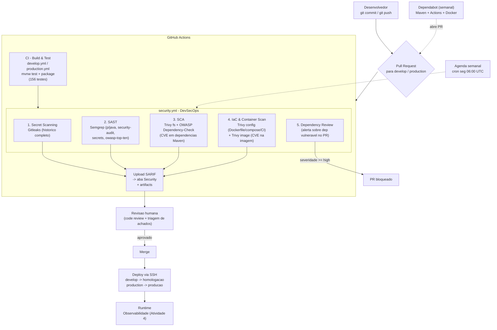
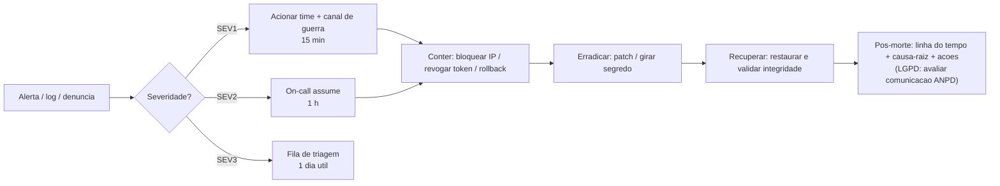

# Sprint 3 — DevSecOps — Projeto RIVA (Cybersecurity)

**Challenge Ford + FIAP 2026 · Desafio 01 — Inteligência Competitiva Automotiva**
Documento único da entrega de Cybersecurity, **separado por atividade** conforme o edital.

| # | Atividade | Peso | Onde estão as evidências |
|---|---|---|---|
| 1 | Pipeline DevSecOps Integrado | 3,0 | [`.github/workflows/security.yml`](../.github/workflows/security.yml), [`.github/dependabot.yml`](../.github/dependabot.yml), [`.gitleaks.toml`](../.gitleaks.toml) |
| 2 | Segurança em Código e Infraestrutura | 2,5 | [`Dockerfile`](../Dockerfile), [`.dockerignore`](../.dockerignore), `src/main/java/com/ford/riva/**`, [`SECURITY.md`](../SECURITY.md) |
| 3 | Compliance, Riscos e Segurança Contínua | 2,5 | Este documento (§3) + [`SECURITY.md`](../SECURITY.md) |
| 4 | Observabilidade, Monitoramento e Resposta | 2,0 | [`observability/`](../observability/), [`RUNBOOK_RESPOSTA_INCIDENTES.md`](RUNBOOK_RESPOSTA_INCIDENTES.md) |

> **Nota total:** média ponderada das quatro atividades (0–10 cada).

## Contexto — evolução das sprints anteriores

Nas sprints anteriores de Cybersecurity a segurança do backend RIVA foi implementada
como **5 blocos de defesa em profundidade** (validação de entrada, autenticação/RBAC,
proteção de APIs, criptografia/LGPD, logging/auditoria) e **documentada** no
[`SECURITY.md`](../SECURITY.md), com **156 testes automatizados** e mapeamento OWASP Top 10.

Esta sprint **evolui esse trabalho para um modelo DevSecOps**: a segurança deixa de ser
"um documento + código" e passa a ser **parte contínua do ciclo** — verificada a cada
commit no pipeline, monitorada em runtime e com procedimento de resposta a incidentes.



Ambiente de referência: repositório `FORD-FIAP/rivaIA-backend`, branches `develop`
(homologação) e `production` (produção), deploy via SSH, PostgreSQL na Azure.

---

# Atividade 1 — Pipeline DevSecOps Integrado (Peso 3,0)

**Objetivo:** demonstrar como a segurança é incorporada ao pipeline de desenvolvimento,
desde o commit até o deploy.

## 1.1 Desenho do pipeline



## 1.2 Etapas e o risco que cada uma reduz

| # | Etapa | Ferramenta (OSS, sem conta) | O que detecta | Risco reduzido (liga ao STRIDE / OWASP) | Gate |
|---|---|---|---|---|---|
| 1 | **Secret Scanning** | Gitleaks 8.21 | Chaves, tokens, senhas no código e em **todo o histórico git** | *Information Disclosure*; A02:2021 (Cryptographic Failures); vazamento de `JWT_SECRET`/`AES_ENCRYPTION_KEY`/`DB_PASSWORD` | **Bloqueia** (`--exit-code 1`); falsos-positivos de dev tratados no [`.gitleaks.toml`](../.gitleaks.toml) |
| 2 | **SAST** | Semgrep OSS (`p/java`, `p/security-audit`, `p/secrets`, `p/owasp-top-ten`) | Injection, cripto fraca, deserialização insegura, path traversal, uso incorreto de APIs Spring Security | *Tampering/Elevation*; A03:2021 (Injection), A02, A08 | Alerta + SARIF na aba Security (não bloqueia o merge; entra na triagem) |
| 3 | **SCA** | Trivy `fs` (CLI) + OWASP Dependency-Check | CVEs conhecidas nas dependências transitivas do Maven | *Elevation of Privilege*; A06:2021 (Vulnerable & Outdated Components) | Relatório + SARIF (CRITICAL/HIGH); triagem humana |
| 4 | **IaC & Container Scan** | Trivy `config` + Trivy `image` (CLI) | Dockerfile/compose/workflows inseguros; CVEs no SO-base da imagem | *Tampering*; A05:2021 (Security Misconfiguration) | Relatório + SARIF; revisão obrigatória se `CRITICAL` |
| 5 | **Dependency Review** | `actions/dependency-review-action` (`warn-only`) | Dependência nova vulnerável ou com licença incompatível **introduzida no PR** | A06:2021; supply chain | Comentário/resumo no PR — dormente até criar a variável de repo `ENABLE_DEPENDENCY_REVIEW=true` e habilitar *Dependency graph* em Settings → Code security |
| — | **Dependabot** | GitHub nativo | Versões desatualizadas / advisories (Maven, Actions, Docker) | A06:2021; manutenção contínua | Abre PR automático semanal → passa pelo pipeline |

> **Modo de operação:** o **Secret Scanning bloqueia** (segredo no repo é parada
> obrigatória). Os demais scanners (SAST, SCA, IaC/Container, Dependency Review)
> rodam em **modo informativo** nesta entrega — publicam achados (artifacts + aba
> Security) e o gate é a **revisão humana**. Para virar gate automático depois,
> remova os `continue-on-error` / `exit-code 0` dos jobs desejados e habilite
> *Dependency graph* + *Code scanning* nas configurações do repositório.

## 1.3 Gatilhos, saídas e integração

- **Gatilhos** (`security.yml`): `push` e `pull_request` em `main`/`develop`/`production`,
  **agenda semanal** (segunda 06:00 UTC) e `workflow_dispatch` manual.
- **Saídas:** cada job publica um **artifact** (relatório) e envia **SARIF** para a aba
  *Security* do GitHub (`security-events: write`), com `continue-on-error` para não
  derrubar o build caso o repositório não tenha o painel de Code Scanning habilitado.
- **Relação com o CI existente:** o `develop.yml`/`production.yml` continuam responsáveis
  por build+teste; o `security.yml` roda em paralelo. O deploy via SSH só ocorre após o
  merge, que exige CI verde + revisão dos achados de segurança.
- **Segredo opcional do CI:** `NVD_API_KEY` (acelera o download da base de CVEs do
  Dependency-Check). Configurar em *Settings → Secrets and variables → Actions*.

## 1.4 Como seria executado no projeto Ford

1. Dev abre PR para `develop`. Rodam `CI - Develop` + `DevSecOps - Security Pipeline`.
2. Gitleaks sinaliza segredos (bloqueia); Semgrep, SCA e Trivy publicam achados para triagem.
3. Semgrep/SCA/Trivy publicam achados; o revisor tria (corrige agora / cria issue / risco aceito).
4. Merge em `develop` → deploy automático em homologação.
5. PR `develop → production` repete o pipeline; após aprovado, deploy em produção via SSH.
6. Semanalmente: Dependabot abre PRs de atualização e o `security.yml` reexecuta a varredura completa.

**Evidências a anexar:** print da aba *Actions* com os jobs verdes (Secret Scan, SAST, SCA e IaC/Container; Dependency Review fica dormente); print da aba
*Security → Code scanning* com os achados por categoria; print do resumo do
Dependency Review no PR; screenshot dos artifacts (`gitleaks-report`,
`semgrep-report`, `sca-reports`, `trivy-reports`) e de um relatório Trivy (`*.txt`).

---

# Atividade 2 — Segurança em Código e Infraestrutura (Peso 2,5)

**Objetivo:** evidenciar práticas de segurança aplicadas diretamente no código e na infraestrutura.

## 2.1 Segurança no código — o que já existe e o que foi reforçado nesta sprint

| Tema | Implementação | Arquivo / classe | Origem |
|---|---|---|---|
| **Criptografia local** | AES-256-GCM (autenticada) no `User.email`; blind index HMAC-SHA256 (`email_hash`) para busca em coluna cifrada; BCrypt strength 12 nas senhas | `crypto/AesEncryptor.java`, `crypto/EmailHasher.java` | sprint anterior |
| **Hardening de API — rate limit** | Bucket4j: 60 req/min geral, 10 req/min em `/auth/login`; `429` + `Retry-After`; WARN a 80% | `security/filter/RateLimitFilter.java` | sprint anterior |
| **Hardening de API — validação de entrada** | 4 camadas: `@NotBlank`/`@Size`/`@Pattern` + `@SafeText` (análise semântica de XSS/SQLi/command injection/path traversal) | `util/InputSanitizer.java`, `validation/SafeTextValidator.java`, DTOs `dto/request/**` | sprint anterior |
| **Hardening de API — JWT seguro** | HS256, secret ≥ 32 bytes por env, access 30 min / refresh 7 dias, validação de assinatura e expiração, sessão STATELESS | `security/jwt/JwtTokenProvider.java`, `JwtAuthenticationFilter.java` | sprint anterior |
| **Integridade de payload** | HMAC-SHA256 no header `X-Signature` (POST/PUT), comparação em tempo constante | `security/filter/PayloadIntegrityFilter.java` | sprint anterior |
| **Erros sem vazamento** | `GlobalExceptionHandler` cobre 12 exceções; nunca expõe stack trace, classe interna, estrutura de banco | `exception/GlobalExceptionHandler.java` | sprint anterior |
| **Actuator isolado** ⭐ | Em produção o Actuator sobe em **porta de gestão separada (9090)**; exposição reduzida a `health,info,prometheus`; `env/beans/heapdump/loggers` bloqueados | `application.properties`, `application-prod.properties`, `SecurityConfig.java` | **esta sprint** |
| **Headers de erro/proxy** ⭐ | `server.error.include-stacktrace=never`, `include-message=never`; `forward-headers-strategy=native` + `remoteip` para IP real atrás do proxy | `application-prod.properties` | **esta sprint** |
| **Log em arquivo JSON** ⭐ | Appender rotacionado (`riva-backend.json`, 50 MB × 7 dias, gzip) para ingestão pelo Loki | `logback-spring.xml` | **esta sprint** |
| **Atualização de dependências** ⭐ | Correção guiada pelo SCA — ver §2.4 | `pom.xml` | **esta sprint** |

⭐ = mudança desta sprint. Ver o `git diff` da branch `feature/sprint3-devsecops`.

### 2.4 Correção guiada pelo SCA — atualização de dependências

Na primeira execução do pipeline, a etapa de **SCA (Trivy)** reprovou o PR com
**~30 CVEs HIGH/CRITICAL** em dependências transitivas do Spring Boot **3.3.5**
(Spring Framework, Spring Security, Tomcat embed, driver PostgreSQL, Spring Data
Commons). Correção aplicada no [`pom.xml`](../pom.xml):

| Componente | Antes | Depois | CVEs resolvidas (exemplos) |
|---|---|---|---|
| `spring-boot-starter-parent` | 3.3.5 | **3.5.16** | CVE-2026-40973 (RCE via tmp dir), CVE-2025-22235 |
| `spring-webmvc` / `spring-expression` / `spring-core` (via BOM) | 6.1.14 | **6.2.19** | CVE-2026-41845 (XSS), CVE-2026-41842/41850 (DoS), CVE-2025-41249 |
| `spring-security-web` / `-crypto` (via BOM) | 6.3.4 | **6.5.11** | **CVE-2026-22732 (CRITICAL — bypass de política de segurança)**, CVE-2025-22228 |
| `spring-data-commons` (via BOM) | 3.3.5 | **3.5.13** | CVE-2026-41716 (DoS por exaustão de cache) |
| `tomcat-embed-core` (`tomcat.version`) | 10.1.31 | **10.1.59** | **CVE-2024-50379 / CVE-2026-43515 / -65182 / -65905 / -68525 (CRITICAL)**, CVE-2025-55752 (dir traversal → RCE) e ~15 DoS/inf-disclosure |
| `postgresql` (`postgresql.version`) | 42.7.4 | **42.7.12** | CVE-2026-54291 (MITM via downgrade SCRAM), CVE-2025-49146, CVE-2026-42198 |
| `springdoc-openapi-starter-webmvc-ui` | 2.6.0 | **2.8.9** | compatibilidade com Spring Boot 3.5 |

**Validação:** `./mvnw clean test` → **145/145 testes passando** após o upgrade
(sem mudança de código de aplicação). O overlay de versões de `tomcat` e
`postgresql` fica em `<properties>` do `pom.xml`, comentado como *override de
segurança*, para o caso de o BOM ainda não ter alcançado a versão corrigida.

### Controle de acesso por perfil

O edital cita perfis genéricos (Brigadista, Gestor, Administrador). No RIVA o RBAC é
implementado com três papéis equivalentes, aplicados no `SecurityFilterChain`:

| Papel RIVA | Equivalente no edital | Permissões |
|---|---|---|
| `ADMIN` | Administrador | Tudo, incluindo `/api/v1/admin/**`, `/api/v1/users/**` e Actuator |
| `ANALYST` | Gestor | Consultas e comparações de veículos (`/api/v1/vehicles/**`, `/versions/**`, `/brands/**`, ...) |
| `USER` | Brigadista / operador | Acesso autenticado básico; sem acesso a dados de administração |

Enforcement: `SecurityConfig.java` (`authorizeHttpRequests` + `@EnableMethodSecurity`),
`CustomUserDetailsService` converte `Role` em `ROLE_<nome>`. Testes:
`security/SecurityFilterChainIntegrationTest.java`.

## 2.2 Segurança MQTT/TLS para IoT — design de referência

**A solução RIVA não possui camada IoT.** É uma plataforma de inteligência competitiva
(API REST + web Next.js + app React Native/Expo); não há dispositivos, firmware nem
broker MQTT no escopo. O tema é coberto aqui como **design de referência** — como a
telemetria seria protegida caso um componente IoT fosse adicionado (ex.: coleta de dados
de veículos em pista para o benchmark da Ranger Raptor):

| Controle | Especificação de referência |
|---|---|
| Transporte | MQTT sobre **TLS 1.2+** (porta 8883), cifras AEAD apenas, sem downgrade |
| Autenticação do device | **mTLS** — certificado X.509 por dispositivo, emitido por CA interna; sem usuário/senha compartilhados |
| Autorização | **ACL por tópico** no broker (ex.: device `ABC` só publica em `riva/telemetry/ABC/#`) |
| Identidade | `client-id` amarrado ao CN do certificado; rejeição de conexões com id divergente |
| Rotação | Validade curta (90 dias) + rotação automatizada; CRL/OCSP para revogação |
| Payload | Assinatura HMAC no payload (reuso do padrão do `PayloadIntegrityFilter`) e schema validation na ingestão |
| Rede | Broker em subnet privada; ingestão para a API só via fila interna, nunca exposição direta |

## 2.3 IaC Security

| Artefato | Boas práticas aplicadas | Verificação |
|---|---|---|
| [`Dockerfile`](../Dockerfile) | Multi-stage (build isolado do runtime); imagem-base **fixada por digest/versão** (`eclipse-temurin:21.0.5_11-jre-alpine`, sem `:latest`); `apk upgrade` do SO-base; **usuário não-root** (`riva`, `/sbin/nologin`); sem segredos embutidos (tudo por env em runtime); camadas do Spring Boot separadas (menor superfície); `HEALTHCHECK` no liveness probe | Trivy `config` no job `iac-container-scan` |
| [`.dockerignore`](../.dockerignore) | Exclui `.git`, `.env*`, `*.p12/*.pem/*.key`, `docs/`, `observability/` do contexto de build | — |
| [`docker-compose.yml`](../docker-compose.yml) | Postgres só para dev local; healthcheck; sem portas desnecessárias | Trivy `config` |
| `application-prod.properties` | Conexão ao Postgres Azure com **`sslmode=require`** (TLS obrigatório); credenciais 100% por variável de ambiente | revisão + `SECURITY.md` §11 |
| [`security.yml`](../.github/workflows/security.yml) | `permissions` mínimas por workflow; `concurrency` para cancelar runs obsoletas; versões de actions fixadas | Trivy `config` + Dependabot (`github-actions`) |

**Evidências a anexar:** saída do `docker build`; saída do Trivy `config` e `image`
(artifact `trivy-reports`); `docker run` mostrando o processo como usuário `riva` (`id`).

---

# Atividade 3 — Compliance, Riscos e Segurança Contínua (Peso 2,5)

**Objetivo:** demonstrar que o sistema segue boas práticas, normas e políticas de segurança.

## 3.1 Revisão final de riscos — STRIDE + DevSecOps

| Componente | Ameaça (STRIDE) | Mitigação implementada | Camada DevSecOps que reforça | Status |
|---|---|---|---|---|
| API REST | **S**poofing de usuário | JWT HS256 + validação de assinatura; sessão stateless | SAST (uso correto do filtro); testes de auth | ✅ Mitigado |
| API REST | **T**ampering de payload | HMAC-SHA256 `X-Signature` (prod); Bean Validation + `@SafeText` | SAST (injection); Semgrep `owasp-top-ten` | ✅ Mitigado |
| API REST | **R**epudiation | Trilha de auditoria `AuditLog` (transação `REQUIRES_NEW`) | Log em arquivo JSON + Loki (Atividade 4) | ✅ Mitigado |
| Dados (`User`) | **I**nformation Disclosure | AES-256-GCM em repouso; blind index; `@JsonIgnore`; DTOs de resposta | Secret Scanning (chaves); SCA (libs de cripto) | ✅ Mitigado |
| Autenticação | **D**enial of Service (brute force) | `LoginAttemptService` (janela 5 min) + rate limit 10/min no login | Alertas `AuthLoginFailureSpike` / `RateLimitRejectionSpike` | ✅ Mitigado + monitorado |
| API REST | **D**enial of Service (flooding) | Bucket4j 60/min por IP; `429` + `Retry-After` | Alerta `RateLimitRejectionSpike`; runbook DoS | ✅ Mitigado + monitorado |
| Autorização | **E**levation of Privilege | RBAC no `SecurityFilterChain` + `@EnableMethodSecurity` | SAST; teste `SecurityFilterChainIntegrationTest` | ✅ Mitigado |
| Dependências | **E**levation via CVE em lib | — | **SCA (Dependency-Check + Trivy) + Dependabot** | 🔄 Contínuo |
| Pipeline / supply chain | **T**ampering no build | `permissions` mínimas; actions fixadas; Dependency Review | **Trivy config + Dependency Review** | 🔄 Contínuo |
| Infra / imagem | **T**ampering / Misconfig | Dockerfile endurecido; Actuator isolado; TLS no banco | **Trivy config + image** | ✅ Mitigado + monitorado |
| Observabilidade | **I** (log com dado pessoal) | Política "sem senha/token/PII no log"; só `username` em eventos | Revisão de PR + Semgrep `secrets` | ✅ Mitigado |

Legenda: ✅ mitigado e verificado · 🔄 controlado por processo contínuo.

## 3.2 Mapeamento com normas e boas práticas

### OWASP ASVS 4.0 — nível 2 (controles-chave)

| Cap. | Requisito | Evidência RIVA | Status |
|---|---|---|---|
| V2 Autenticação | Senha com hash forte + política | BCrypt strength 12; `RegisterRequest` com `@Size`/`@Pattern` | ✅ |
| V2 Autenticação | Proteção contra brute force | `LoginAttemptService` + rate limit login | ✅ |
| V3 Sessão | Tokens stateless, expiração curta, sem sessão no servidor | JWT access 30 min / refresh 7 dias; `SessionCreationPolicy.STATELESS` | ✅ |
| V4 Controle de acesso | RBAC deny-by-default | `anyRequest().authenticated()` + matchers por papel | ✅ |
| V5 Validação | Validação positiva (whitelist) e sanitização | `@Pattern` whitelist + `InputSanitizer` | ✅ |
| V7 Erros e logs | Sem stack trace ao cliente; log estruturado | `GlobalExceptionHandler`; `logback-spring.xml` JSON | ✅ |
| V8 Proteção de dados | Cripto em repouso de dado pessoal | AES-256-GCM no `email` | ✅ |
| V9 Comunicação | TLS em trânsito | HTTPS documentado (`SECURITY.md` §12); Postgres `sslmode=require` | ⚠️ TLS da API ativado só em produção |
| V10 Código malicioso | SAST + SCA no CI | Semgrep + Dependency-Check/Trivy | ✅ |
| V12 Arquivos/recursos | Sem path traversal | `InputSanitizer` (padrões `../`, `%2e%2e`, `/etc/passwd`) | ✅ |
| V13 APIs | Rate limiting, autenticação em todos os endpoints não públicos | RateLimitFilter; matchers | ✅ |
| V14 Configuração | Build reprodutível; sem segredo em repo; headers seguros | Docker multi-stage; env vars; Gitleaks | ✅ |

### OWASP API Security Top 10 (2023)

| ID | Risco | Tratamento RIVA | Status |
|---|---|---|---|
| API1 | Broken Object Level Authorization | Endpoints por papel; IDs internos (surrogate keys); sem exposição de objeto de outro usuário | ✅ |
| API2 | Broken Authentication | JWT validado, expiração, brute-force detection | ✅ |
| API3 | Broken Object Property Level Authorization | DTOs de resposta separados das entidades; `@JsonIgnore` no password | ✅ |
| API4 | Unrestricted Resource Consumption | Rate limit Bucket4j; `@Size` em campos e listas (máx. 50 atributos / 200 chars) | ✅ |
| API5 | Broken Function Level Authorization | RBAC no filter chain + method security | ✅ |
| API6 | Unrestricted Access to Sensitive Business Flows | Rate limit no login; auditoria de `MASS_QUERY` | ✅ |
| API7 | SSRF | Sem fetch de URL fornecida pelo cliente no backend; scraping (se houver) isolado no serviço de IA | ✅ (n/a no backend) |
| API8 | Security Misconfiguration | Trivy config; Actuator isolado; CORS restritivo; erros genéricos | ✅ |
| API9 | Improper Inventory Management | OpenAPI/Swagger versionado (`/v3/api-docs`); ambientes `dev`/`prod` separados | ✅ |
| API10 | Unsafe Consumption of 3rd-party APIs | SCA nas libs; validação de schema na borda | 🔄 |

### OWASP Mobile Top 10 (2024) — app React Native / Expo

O app é responsabilidade da disciplina de Mobile; abaixo o mapa de responsabilidade
compartilhada (o que o backend garante × o que o time mobile precisa garantir):

| ID | Risco | Backend garante | Time mobile precisa garantir |
|---|---|---|---|
| M1 Credential Usage | — | Não embutir credenciais no bundle; usar fluxo de login |
| M2 Supply Chain | SCA no backend | `npm audit` / Dependabot no repo mobile |
| M3 Auth/Authz | JWT + RBAC no servidor | Não confiar em checagem local; renovar via `/auth/refresh` |
| M4 Input/Output validation | Validação server-side | Sanitizar entrada antes de exibir (anti-XSS em WebView) |
| M5 Insecure Communication | TLS obrigatório; CORS | Certificate pinning; recusar HTTP |
| M6 Privacy | Pseudonimização; LGPD | Não logar PII no device; pedir consentimento |
| M7 Binary Protections | — | Ofuscação; detectar root/jailbreak se aplicável |
| M8 Security Misconfiguration | Headers; erros genéricos | Desabilitar debug no build de release |
| M9 Insecure Data Storage | — | `expo-secure-store` para o token, nunca `AsyncStorage` puro |
| M10 Insufficient Cryptography | AES-256-GCM no servidor | Não implementar cripto própria; usar APIs da plataforma |

### LGPD (Lei 13.709/2018)

Detalhado no [`SECURITY.md`](../SECURITY.md) §8. Resumo:

| Item | Tratamento |
|---|---|
| Dados pessoais tratados | `username`, `email` (cifrado), IP em log de auditoria |
| Base legal | Execução de contrato / legítimo interesse (ferramenta corporativa) |
| Minimização | Só o necessário para autenticação e auditoria; busca de veículos não tem PII |
| Retenção | Tokens: 30 min / 7 dias · `AuditLog`: 90 dias (job de anonimização diário) · `User`: enquanto conta ativa |
| Direito à exclusão (Art. 18, V) | `AnonymizationService.anonymizeUser(id)` — substituição irreversível, preserva integridade referencial |
| Pseudonimização p/ ML e BI | `email_hash` (HMAC) como pseudônimo estável; `AuditLog` pós-retenção com `user_id`/`ip` nulos; segregação de chave `EXPORT_SECRET` |
| Segurança do tratamento (Art. 46) | Cripto em repouso e trânsito, RBAC, auditoria, logging sem PII |

## 3.3 Plano de segurança contínua

### Rotina de revisão de dependências

| Quando | Ação | Responsável |
|---|---|---|
| Semanal (automático) | Dependabot abre PRs (Maven, Actions, Docker); `security.yml` roda SCA completo | CI |
| A cada PR | Dependency Review comenta dependência vulnerável nova (warn-only) | CI + revisor |
| Semanal (humano) | Triagem dos achados de SCA: classificar CVSS, alcançabilidade, exploit; agir ou registrar risco aceito com prazo | Responsável de segurança |
| Release | Confirmar que não há CVE ≥ 7 pendente sem mitigação | Líder técnico |

### Rotina de testes de segurança

| Quando | Ação |
|---|---|
| A cada commit/PR | SAST (Semgrep), Secret Scanning (Gitleaks), 156 testes automatizados |
| A cada PR | Checklist de segurança no template de PR (ver §3.3 "checklist de PR") |
| Por sprint | Pentest interno leve: OWASP ZAP em modo baseline contra homologação; revisão manual de um fluxo crítico |
| Trimestral | Revisão do modelo de ameaças (STRIDE) e do mapeamento ASVS |

**Checklist de PR (sugestão para `.github/pull_request_template.md`):**
- [ ] Entrada nova validada (`@Valid` + `@SafeText` onde aplicável)
- [ ] Endpoint novo coberto por regra de RBAC explícita
- [ ] Nenhum dado sensível em log / resposta / URL
- [ ] Segredo novo via variável de ambiente (documentado no `SECURITY.md` §11)
- [ ] Teste automatizado cobrindo o caminho de erro/negação
- [ ] Pipeline de segurança verde (ou achados triados)

### Rotina de auditoria de permissões

| Quando | Ação |
|---|---|
| Mensal | Listar usuários com papel `ADMIN`; confirmar necessidade; remover excedentes |
| Mensal | Revisar matchers do `SecurityConfig` vs. endpoints existentes (nenhum endpoint sem regra) |
| Por sprint | Revisar acessos ao repositório GitHub e aos segredos do Actions; remover ex-membros |
| Trimestral | Revisar validade/rotação de `JWT_SECRET`, `AES_ENCRYPTION_KEY`, `EMAIL_HASH_SECRET`, `HMAC_SECRET` |

### Rotina de backup e recuperação (iniciada em sprint anterior — Fase 3)

| Item | Definição |
|---|---|
| Escopo | PostgreSQL de produção (Azure Database for PostgreSQL) |
| Backup | Automático da Azure — full diário + WAL contínuo (Point-in-Time Restore) |
| Retenção | 7 dias de PITR (configurável até 35) |
| **RPO** | ≤ 5 min (perda máxima aceitável de dados) |
| **RTO** | ≤ 1 h (tempo máximo para restaurar o serviço) |
| Teste de restore | Mensal — restaurar snapshot num banco temporário e rodar smoke test da API |
| Segredos | Guardados no secret store (Actions Secrets / Key Vault); export cifrado offline trimestral |
| Auditoria | Confirmar que `AuditLog` e dados cifrados voltam íntegros após restore (GCM tag valida) |

## 3.4 Checklist de conformidade consolidado

| Domínio | Item | Status | Evidência |
|---|---|---|---|
| Pipeline | Secret scanning em todo commit e histórico | ✅ | `security.yml` job `secret-scan` |
| Pipeline | SAST em todo PR | ✅ | job `sast` |
| Pipeline | SCA + Dependabot ativos | ✅ | job `sca` + `dependabot.yml` |
| Pipeline | IaC e imagem escaneadas | ✅ | job `iac-container-scan` |
| Pipeline | PR sinaliza dependência vulnerável nova | ✅ | job `dependency-review` (warn-only) |
| Código | Entrada validada e sanitizada (4 camadas) | ✅ | `InputSanitizer`, DTOs, 156 testes |
| Código | AuthN JWT + AuthZ RBAC | ✅ | `security/**`, `SecurityConfig` |
| Código | Cripto em repouso de PII | ✅ | `crypto/AesEncryptor` |
| Código | Erros sem vazamento de internals | ✅ | `GlobalExceptionHandler` |
| Infra | Imagem não-root, base fixada, multi-stage | ✅ | `Dockerfile` + Trivy |
| Infra | Actuator isolado em produção | ✅ | `application-prod.properties` |
| Infra | TLS no banco (`sslmode=require`) | ✅ | `application-prod.properties` |
| Infra | TLS na API | ⚠️ | documentado, ativar em produção (`SECURITY.md` §12) |
| Compliance | OWASP ASVS nível 2 mapeado | ✅ | §3.2 |
| Compliance | OWASP API Top 10 mapeado | ✅ | §3.2 |
| Compliance | OWASP Mobile Top 10 mapeado (resp. compartilhada) | ✅ | §3.2 |
| Compliance | LGPD — direitos, retenção, pseudonimização | ✅ | `SECURITY.md` §8 |
| Contínuo | Rotina de revisão de dependências | ✅ | §3.3 |
| Contínuo | Rotina de testes de segurança | ✅ | §3.3 |
| Contínuo | Rotina de auditoria de permissões | ✅ | §3.3 |
| Contínuo | Rotina de backup + teste de restore | ✅ | §3.3 |
| Runtime | Métricas + alertas de segurança | ✅ | `observability/` (Atividade 4) |
| Runtime | Plano de resposta a incidentes | ✅ | `RUNBOOK_RESPOSTA_INCIDENTES.md` |

---

# Atividade 4 — Observabilidade, Monitoramento e Resposta (Peso 2,0)

**Objetivo:** mostrar como o sistema detecta, registra e responde a incidentes.
Artefatos executáveis em [`observability/`](../observability/).

## 4.1 Plano de monitoramento

### Logs estruturados

| Aspecto | Definição |
|---|---|
| Formato | JSON (`LogstashEncoder`) nos profiles `prod`/`obs`; console legível em `dev`/`test` |
| Campos fixos | `timestamp`, `level`, `logger_name`, `message`, `thread_name`, `application` |
| Correlação (MDC) | `trace_id` (UUID por request), `user_id`, `client_ip` — populados pelo `MdcFilter` (1º filtro) |
| Destino | stdout (ELK/Datadog no ambiente real) **e** arquivo rotacionado `logs/riva-backend.json` → Promtail → Loki |
| Rotação | 50 MB por arquivo, 7 dias, compactação gzip, cap de 1 GB |
| **É logado** | login OK/falho, registro de usuário, anonimização (LGPD), brute force detectado, rate limit, HMAC inválido, 404 de scan, acesso negado |
| **Nunca é logado** | senha, hash de senha, token JWT, e-mail ou outro dado pessoal (só `username` em eventos) |

Eventos monitorados (regras já existentes no código — ver `SECURITY.md` §10):

| Regra | Origem | Nível |
|---|---|---|
| 5+ falhas de login do mesmo IP em 5 min | `AuthService` + `LoginAttemptService` | ERROR |
| Falha de login isolada | `AuthService` | WARN |
| IP a 80% / acima do rate limit | `RateLimitFilter` | WARN |
| Assinatura HMAC inválida | `PayloadIntegrityFilter` | WARN |
| 404 em endpoint inexistente (scan) | `GlobalExceptionHandler` | WARN |
| Acesso não autenticado / negado | `JwtAuthenticationEntryPoint` / `JwtAccessDeniedHandler` | WARN |

### Métricas e alertas

- **Coleta:** Spring Boot Actuator + Micrometer → `/actuator/prometheus` (porta de gestão
  9090 em produção) → Prometheus (scrape 15 s).
- **Métricas-chave:** `http_server_requests_seconds_*` (taxa, status, latência p50/p95/p99),
  `logback_events_total{level="error"}`, `jvm_memory_used_bytes`, `process_cpu_usage`,
  `hikaricp_connections_active`.
- **Alertas** ([`observability/prometheus/alert.rules.yml`](../observability/prometheus/alert.rules.yml)):

| Alerta | Condição | Severidade | Playbook |
|---|---|---|---|
| `RivaBackendDown` | `up == 0` por 1m | critical | Runbook §Serviço indisponível |
| `HighHttp5xxRate` | > 5% de 5xx por 5m | critical | Runbook §Erros 5xx |
| `ErrorLogSurge` | > 20 logs ERROR / 10m | warning | Runbook §Surto de erros |
| `AuthLoginFailureSpike` | > 30 falhas de login/min por 3m | warning (seg.) | Runbook §Brute force |
| `RateLimitRejectionSpike` | > 120 respostas 429/min por 3m | warning (seg.) | Runbook §Flooding/DoS |
| `ForbiddenResponseSpike` | > 60 respostas 403/min por 5m | info (seg.) | triagem |
| `NotFoundScanSpike` | > 100 respostas 404/min por 5m | info (seg.) | triagem |
| `HighLatencyP99` | p99 > 1s por 10m | warning | investigação de performance |
| `JvmHeapPressure` | heap > 90% por 10m | warning | investigar leak / ajustar memória |
| `HighCpuUsage` | CPU > 85% por 10m | warning | investigar carga |

- **Roteamento:** Alertmanager com receiver dedicado `seguranca` (webhook/e-mail a
  preencher) e `inhibit_rule` para silenciar derivados quando o serviço está fora do ar.
- **SLOs de referência:** disponibilidade 99,5% mensal; p99 < 500 ms; erro 5xx < 1%.

### Dashboards

Stack em [`observability/docker-compose.observability.yml`](../observability/docker-compose.observability.yml):
Prometheus + Alertmanager + Loki + Promtail + Grafana. Dashboard provisionado
**"RIVA - Segurança & Observabilidade"** ([`riva-observability.json`](../observability/grafana/dashboards/riva-observability.json))
com linhas: Visão geral · HTTP · **Segurança** (falhas de login, 429, 403/404, painel
de logs de eventos de segurança, painel de logs ERROR) · Recursos.

Subir: `docker compose -f observability/docker-compose.observability.yml up -d` →
Grafana em http://localhost:3001.

## 4.2 Plano de resposta a incidentes

Ciclo **Detecção → Análise → Contenção → Erradicação → Recuperação → Pós-morte**,
com papéis, severidades (SEV1–SEV3), canais e playbooks por tipo de evento
(brute force, flooding, 5xx, serviço fora do ar, segredo vazado, dependência vulnerável)
detalhados no [`RUNBOOK_RESPOSTA_INCIDENTES.md`](RUNBOOK_RESPOSTA_INCIDENTES.md).

Fluxo resumido:



## 4.3 Evidências a anexar

- Screenshot do dashboard Grafana com dados (gerar carga: rodar a app no profile `obs`,
  fazer logins válidos e uma rajada de logins inválidos para acender o painel de brute force).
- Trecho do `logs/riva-backend.json` mostrando um evento `ERROR "Possível brute force detectado"`
  com `trace_id`/`client_ip` (e confirmando ausência de senha/token).
- Screenshot do Prometheus → *Alerts* com uma regra em `PENDING`/`FIRING` durante o teste.
- Print do `docker compose ps` do stack de observabilidade.

---

# Apêndice A — Índice de evidências por atividade

| Arquivo | Atividade |
|---|---|
| `.github/workflows/security.yml` | 1 |
| `.github/dependabot.yml` | 1 |
| `.gitleaks.toml` | 1 |
| `Dockerfile`, `.dockerignore` | 2 |
| `src/main/java/com/ford/riva/config/SecurityConfig.java` (diff) | 2 |
| `src/main/resources/application.properties`, `application-prod.properties` (diff) | 2 |
| `src/main/resources/logback-spring.xml` (diff) | 2, 4 |
| `SECURITY.md` | 2, 3 |
| Este documento §3 | 3 |
| `observability/**` | 4 |
| `docs/RUNBOOK_RESPOSTA_INCIDENTES.md` | 4 |

# Apêndice B — Rodar tudo localmente

```bash
# 1. Testes + build
./mvnw -B clean test

# 2. App com observabilidade (gera logs/riva-backend.json; Actuator na 8080 local, 9090 só em prod)
docker compose up -d                       # Postgres local
SPRING_PROFILES_ACTIVE=dev,obs ./mvnw spring-boot:run

# 3. Stack de monitoramento
docker compose -f observability/docker-compose.observability.yml up -d
#   Grafana      http://localhost:3001  (admin/admin)
#   Prometheus   http://localhost:9091
#   Alertmanager http://localhost:9093

# 4. Imagem de produção endurecida
docker build -t riva-backend:local .
docker run --rm riva-backend:local id      # confirma usuario nao-root "riva"

# 5. Rodar o pipeline de seguranca localmente (opcional)
gitleaks detect --config .gitleaks.toml --redact
docker run --rm -v "$PWD:/src" semgrep/semgrep semgrep scan --config p/java --config p/owasp-top-ten /src
docker run --rm -v "$PWD:/src" aquasec/trivy fs --scanners vuln,misconfig /src
```

# Apêndice C — Segredos do CI a configurar (opcional)

| Segredo | Uso | Sem ele |
|---|---|---|
| `NVD_API_KEY` | Acelera o Dependency-Check (base de CVEs) | Job roda, porém lento |

# Apêndice D — Glossário

**SAST** análise estática do código · **SCA** análise de dependências (CVE) ·
**IaC** infraestrutura como código · **SARIF** formato padrão de achados de segurança ·
**mTLS** TLS mútuo (cliente e servidor com certificado) · **RPO/RTO** perda máxima de
dados / tempo máximo de recuperação · **PITR** restauração para um ponto no tempo.
